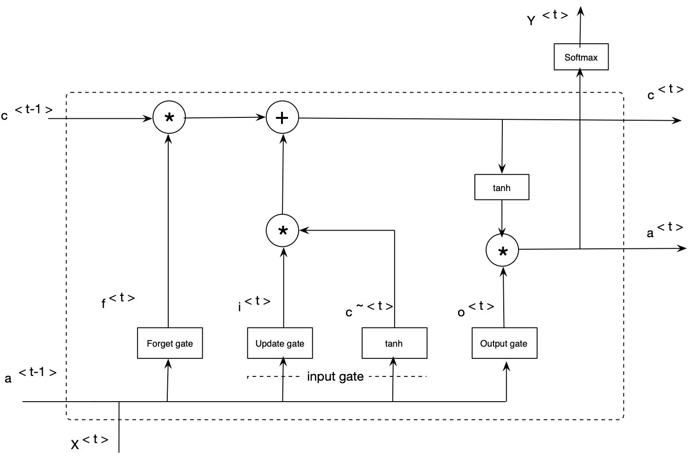
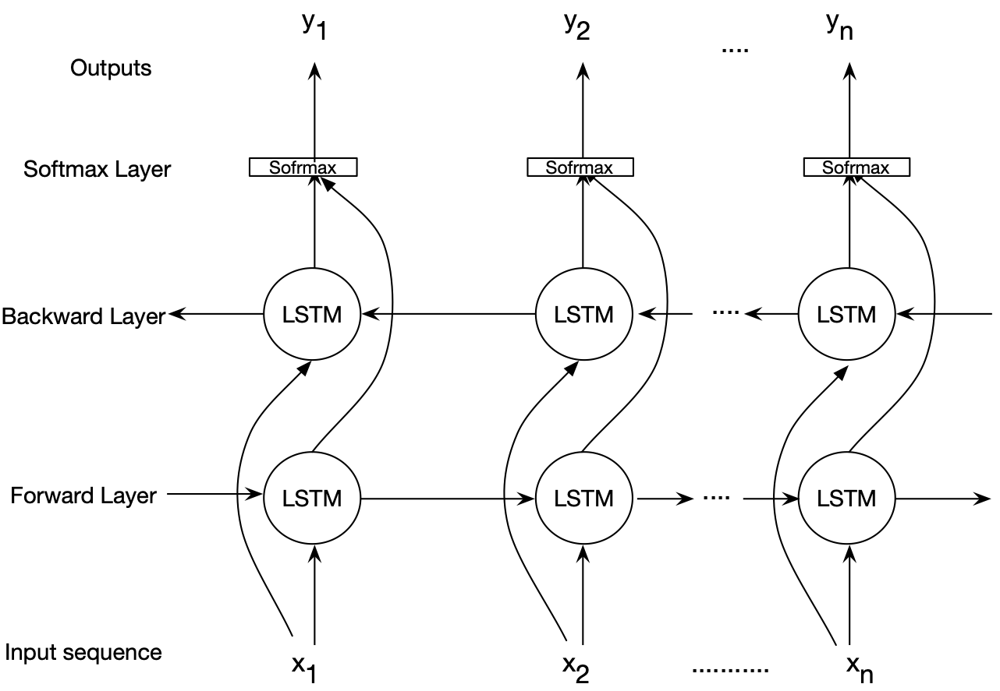

# Modeling-and-Clustering-Genome-using-Bidirectional-LSTM

### Project website: https://nedatavakoli.github.io/Modeling-and-Clustering-Genome-using-Bidirectional-LSTM/

In this project, two Deep-Learning based models are presented to model genome data set: Bidirectioanl LSTM and forward-backward LSTM. If you have any questions feel free to contact us.
##  Model 1: Bidirectional LSTM to model human genome:
The LSTM-based learning networks are an extension for RNNs. These models are capable of addressing the vanishing gradient problem in a very clean manner (i.e., RNN's difficulties in learning long-term dependencies). LSTM networks extend the RNNs memory and enable them learn long-term dependencies. They can remember information over a long period of time and can read, write, and delete information from theirs memories. The LSTM memory is called a **gated cell***, in which a gate refers to its ability to make the decision of preserving or ignoring the memory. The follwoing picture shows one LSTM cell.
LSTM model has the following 

Deep bidirectional LSTMs are an extended version of basic LSTMs where the trained model is obtained by applying LSTM twice. Once, the input sequences are fed as-is into the LSTM model (forward layer), a reversed version of the input sequences (i.e., Watson-Crick complement) will be also fed to the LSTM model (backward layer). Using the bidirectional LSTMs can improve the performance of the model. This work uses bidirectional LSTMs to model genome data. The following figure illustrates an architecture for bidirectional LSTM model employed in this project.

The feasibility of the proposed BiLSTM-based model is demonstrated through a case study in which sequences of one chromosome are modeled. We developed several Python scripts to implement and assess the modeling aspect of the proposed BiLSTM-based genome modeling algorithm. We evaluated the model using human genome as the reference sequence and a set of short reads generated using Illumina sequencing technology as the query sequences. 

We ran the experiments for the following configurations. At each configuration, we model a reference genome and a list of query sequences. Two types of outputs are reported: vector representations (after training the model using LSTM), and perplexity of each epoch of training. (Note: the code for the BiLSTM model is private and might be given upon request).

# Configuration 1:
	len data:  158970136 characters  (data/Ref Genome]-MT-human2.fa)
	word length =  2
        batch_size=100
	hidden_size=1000
	initial_learning rate=0.001
	num_epochs=100
	num_layers=1
	sequence size=24

	Input dataset:
		Ref genome: data/Ref/MT-human_clean2.fa
		List of query sequences: data/Query/MT-human_clean24.fa
	Outputs:
		1) Vector representations
			Ref genome: Output/ MT-human_clean2_genome_embeddings_sigmoid.csv
			List of query sequences: data/Query/MT-human_clean24_genome_embeddings_sigmoid.csv

		2)Perplexity: 
			Ref genome: Output/Ref/Perplexity for 2, 4, 6
			List of query sequences:  Output/Query/Perplexity for 24, 48, 72
			

# Configuration 2:
	len data:  158970136 characters  (data/MT-human4.fa)
	word length = 4
        batch_size=100
	hidden_size=1000
	initial_learning rate=0.001
	num_epochs=100
	num_layers=1
	sequence size=48

	Input dataset:
		Ref genome: data/Ref/MT-human_clean6.fa
		List of query sequences:  data/Query/MT-human_clean48.fa
	Outputs:
		1) Vector representations
			Ref genome:  Output/Ref/ MT-human_clean4_genome_embeddings_sigmoid.csv
			List of query sequences:  data/Query/MT-human_clean48_genome_embeddings_sigmoid.csv
		2)Perplexity: 
			Ref genome: Output/Ref/Perplexity for 2, 4, 6
			List of query sequences:  Output/Query/Perplexity for 24, 48, 72

			

# Configuration 3:
	len data:  158970136 characters  (data/Ref Genome]-MT-human6.fa)
	word length =  6
        batch_size=100
	hidden_size=1000
	initial_learning rate=0.001
	num_epochs=100
	num_layers=1
	sequence size=72

	Input dataset:
		Ref genome: data/Ref/MT-human_clean6.fa
		List of query sequences: data/Query/MT-human_clean72.fa
	Outputs:
		1) Vector representations
			Ref genome:  Output/ MT-human_clean6_genome_embeddings.csv
			List of query sequences: data/Query/MT-human_clean72_genome_embeddings_sigmoid.csv
		2)Perplexity: 
			Ref genome: Output/Ref/Perplexity for 2, 4, 6
			List of query sequences:  Output/Query/Perplexity for 24, 48, 72
			
			
# Clustering Results:
 Model 1: Bidirectional LSTM 

|Word size | KMeans | DBScan | GMM | Number of clusters |
|--------- | ------ | ------ | --- | ------------------ |
|4 | 0.932 | 0.935 | 0.935 | 5 |
|2 | 0.184 | 0.186 | 0.186 | 4 |
|6 | 0.704 | 0.704 | 0.709 | 2 |

Lane's Model

|Word size | KMeans | DBScan | GMM | Number of clusters |
|--------- | ------ | ------ | --- | ------------------ |
| 4 | 0.305 | 0.206 | 0.305 | 2 |

##  Model 2:  Modeling and Clustering Genome using Foward Backward LSTM
Lane also wrote the code for a forward backward LSTM, where one LSTM progressed forwards through the training data while the other progressed backwards.
This model was trained on the fasta representation for Chromosome 12 dataset for two configurations on Google Colab, the details of which are given as follows:

# Configuration 1
1) Embedding size = 100
2) Number of hidden layers = 2
2) Size (No. of neurons) of hidden layer= 100
3) Number of steps = 35
4) Dictionary comprises 4-character words
5) Batch-size = 20
6) No. of epochs = 10

# Confguration 2 
1) Embedding size = 100
2) Number of hidden layers = 2
2) Size (No. of neurons) of hidden layer= 100
3) Number of steps = 35
4) Dictionary comprises 1-character words
5) Batch-size = 20
6) No. of epochs = 10

# Clustering Results:

|Word size | KMeans | DBScan | GMM | Number of clusters |
|--------- | ------ | ------ | --- | ------------------ |
| 4 | 0.305 | 0.206 | 0.305 | 2 |

##  Model 3:  Modeling English text using LSTM

|Number of epochs |Kmeans | GMM | DBSCAN | file |
|-----------------|-------|-----|--------|------|
| yy | 0.714, 90 | 0.714, 90 | 0.282, 2  | text_vectors_lane_hidden_state_200 |
| yy | 0.722, 87 | 0.718, 88 | 0.435, 2  | text_vectors_lane_cell_state_200|
| yy | 0.728, 87 | 0.724, 87 |	0.457, 2 | text_vectors_lane_200_epochs|
| yy | 0.721, 84 | 0.719, 84 | 0.37, 2   | text_vectors_lane_100_epochs|

### Note:  If you have any questions feel free to contact us:
	Neda Tavakoli, email: neda.tavakoli@gatech.edu, 
	Lane Dalan, email:
	Richa Tibrewal, email: richa.tibrewal@gatech.edu
	Arthita Ghosh, email: aghosh80@gatech.edu
	Harish Kupo KPS:
